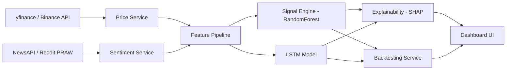

# 🧠 TradeSage AI — Complete Project Memory

> **Last Updated:** 5 October 2026  
> **Repository:** [github.com/dhruv492/TradeSageAI](https://github.com/dhruv492/TradeSageAI)  
> **Status:** Phases 0–3 Complete ✅ | Deployed Locally | Pushed to GitHub

---

## 1. How It All Started

The project began as a **CE363: Project-III** assignment. The user (Dhruv) had an open-ended brief — build something in AI/ML with Python.

### The Decision Journey
| Step | What Happened |
|------|--------------|
| 1 | Started blank — no direction, wanted something that teaches while building |
| 2 | **MedAssist AI** (symptom checker) proposed → rejected, wanted Finance direction |
| 3 | Three finance options pitched: **FinWise** (personal finance), **CreditSense** (credit risk), **MarketPulse** (stock trend prediction) |
| 4 | **Key turning point:** Dhruv revealed he actively trades stocks *and* crypto — domain expertise made MarketPulse viable |
| 5 | Asked about merging MarketPulse's ML engine + FinWise's portfolio shell |
| 6 | **TradeSage AI born** — the merged concept was locked in |

### The Core Philosophy
> *"Decision-support only — NOT financial advice."*

The project was built around **honesty in ML claims** — no misleading accuracy numbers, no black-box predictions. Every signal is explainable, every claim is backtested with real metrics (Sharpe ratio, win-rate, max drawdown).

---

## 2. What TradeSage AI Actually Is

A **personal trading intelligence platform** that combines:
- 📊 **Portfolio tracking** (stocks + crypto, live P&L)
- 🤖 **ML-driven signal engine** (RandomForest baseline vs. LSTM, side-by-side)
- 🔍 **Explainable AI** (SHAP / feature importance — no black box)
- 📈 **Honest backtesting** (Sharpe ratio, win-rate, max drawdown — NOT raw accuracy)
- 👁️ **Watchlist & alerts** for unheld assets
- ⚙️ **Admin panel** for system configuration

---

## 3. Architecture & Tech Stack

### Backend (Python / Flask)
```
backend/
├── app.py                    # Core Flask app — routes, auth, API endpoints (~730 lines)
├── models.py                 # SQLAlchemy ORM — User, Position, Signal, Watchlist tables
├── auth_service.py           # Registration, login, session management
├── portfolio_service.py      # Position tracking, P&L calculations, future-date validation
├── price_service.py          # Live prices via yfinance + Binance public API
├── signal_engine.py          # RandomForest baseline model training & prediction
├── lstm_model.py             # LSTM/GRU deep learning model for comparison
├── feature_pipeline.py       # Technical indicators (RSI, MACD, Bollinger, volume)
├── sentiment_service.py      # NLP sentiment via VADER, NewsAPI, Reddit/PRAW
├── backtesting_service.py    # Sharpe ratio, win-rate, max drawdown calculations
├── explainability_service.py # SHAP values + feature importance extraction
├── watchlist_service.py      # Watchlist CRUD + alert logic
├── admin_service.py          # Admin panel operations
├── signal_service.py         # Signal orchestration layer
├── retrain_scheduler.py      # Automated model retraining scheduler
└── requirements.txt          # 17 dependencies
```

### Frontend (Vanilla HTML / CSS / JS)
```
frontend/
├── index.html        # Landing page — hero section with animated UI
├── auth.html         # Auth gateway — sign-in/sign-up with dark mode toggle
├── dashboard.html    # Main dashboard — all tabs live here
├── css/style.css     # Complete design system (~2300 lines of CSS)
└── js/app.js         # Application logic (~1700 lines of JS)
```

### Key Dependencies
| Library | Purpose |
|---------|---------|
| Flask + Flask-Login | Web framework + session auth |
| SQLAlchemy | ORM for SQLite/PostgreSQL |
| scikit-learn | RandomForest baseline model |
| PyTorch | LSTM/GRU signal model |
| SHAP | Model explainability |
| yfinance | Stock price data |
| VADER Sentiment | Sentiment analysis |
| PRAW | Reddit sentiment scraping |
| pandas / numpy | Data processing |

### Data Flow


---

## 4. The 7 Modules (Dashboard Tabs)

### Tab 1: 🤖 Signal Engine
- Select any asset (stocks like AAPL, GOOGL, TSLA or crypto like BTC-USD, ETH-USD)
- Generates direction prediction: **UP / DOWN / NEUTRAL** with confidence score
- Shows **top contributing factors** (which technical indicators mattered most)
- Compares RandomForest vs. LSTM predictions side-by-side
- Beautiful loading animation while ML models process
- **Plain-English summary** explaining what the signal means for non-traders

### Tab 2: 📊 Honesty Backtesting
- Select assets and run historical backtesting
- Reports **Sharpe Ratio**, **Win Rate**, **Max Drawdown** — NOT raw accuracy
- Loading states per asset while backtesting runs
- Results include a **plain-language summary** (e.g., "This strategy beat the market...")
- Asset selection UI matching the Signal Engine's polished design

### Tab 3: 💼 Portfolio Tracker
- Add positions with asset, quantity, buy price, and date
- **Future-date validation** — blocks recording positions with dates after today
- Live P&L calculation using real-time prices
- Shows position count (not "lots" — clarified after user confusion)
- Tracks both stocks and crypto in one unified view

### Tab 4: 👁️ Watchlist & Alerts
- Track assets you don't hold but want to monitor
- Signal-change notifications
- Quick-add to portfolio when ready to trade

### Tab 5: ⚙️ Admin / Config Panel
- Manage tracked assets
- Model retrain scheduling
- Data source health monitoring

---

## 5. The UI Journey

The frontend went through significant evolution:

### Phase 1: Static → Dynamic
- Initially served as static files (`/static/index.html`) — user flagged this
- Migrated to dynamic Flask routing with proper template serving

### Phase 2: Auth Flow
- Added **Landing Page** (`index.html`) — premium hero section with animated gradient background
- Added **Auth Gateway** (`auth.html`) — sign-in/sign-up with dark mode toggle and 1-click demo login
- **Sign-out** now redirects to landing page (not login — user requested this specifically)

### Phase 3: UI Polishing
- All tabs upgraded to match the Signal Engine's premium aesthetic
- Asset selection dropdowns across all tabs
- Loading animations with shimmer effects
- Glassmorphism cards, smooth transitions, micro-animations
- Dark mode support throughout
- Responsive design for all screen sizes

### Design System Highlights
- **Color palette:** Curated dark theme with HSL-tailored accent colors
- **Typography:** Modern font stack (system fonts, no browser defaults)
- **Animations:** Loading shimmers, hover effects, smooth transitions
- **CSS:** ~2,300 lines of hand-crafted vanilla CSS

---

## 6. Key Decisions & Fixes (Chronological)

| When | Issue | Resolution |
|------|-------|------------|
| Early | Static file serving exposed `/static/` in URL | Switched to dynamic Flask routing |
| Early | Sign-out went to login instead of landing page | Redirect to `index.html` landing page |
| Mid | Login button showed "Processing..." but never completed | Fixed auth endpoint and session handling |
| Mid | Some assets failed backtesting (e.g., GOOGL) | Fixed data pipeline for assets with shorter price history |
| Mid | Backtesting results were raw numbers — confusing for non-traders | Added plain-English summaries explaining what metrics mean |
| Mid | Portfolio showed "2 lots" next to BTC — user confused | Clarified: it means "2 positions recorded", not lot size. 1 BTC ≠ 1000 lots in our context |
| Mid | User added a position dated 30-10-2026 but today was 1-10-2026 | Added **future-date validation** — blocks dates after today |
| Late | CHARUSAT branding throughout codebase | Removed from all source files, READMEs, and footer. Docs folder left for manual editing |
| Late | Unwanted files (.pytest_cache, .bob/) in repo | Cleaned up + added to .gitignore |

---

## 7. Git History (Complete)

```
3e70e8d  Add files via upload (initial upload)
e1ea216  Delete TradeSage_AI_Phase2.zip
b0d3e5d  Add files via upload
e84bdb9  Delete TradeSage_AI_Phase2_updated.zip
fc0de9a  Add files via upload
66b650e  Delete TradeSage_AI_Phase2_updated.zip
c09ea0e  Add files via upload
e1b9698  Delete TradeSage_AI_Phase3.zip
43aeb7a  Initial commit
9e35401  Merge branch 'main'
80adbe1  feat(backend/frontend): modernize backend, SQLAlchemy 2.0, terminal UI
9c969ec  fix(deps): relax version pins for Python 3.14 compatibility
8e9b695  fix(server/ui): modernize lifespan handler, prompt login on 401
2acc804  feat(ui): implement Auth Gateway screen before dashboard unlock
6acf305  feat(auth): institutional terminal hero gateway with 1-click demo login
c4d2c5a  revert(backend): restore canonical Flask architecture and NFR-4 compliance
4b314f3  refactor: remove institution branding, polish UI tabs, add auth flow, cleanup ← LATEST
```

---

## 8. Project File Map (Complete)

```
TradeSageAI/
├── .env.example              # Environment variable template
├── .gitignore                # Git ignore rules (includes .bob/)
├── README.md                 # Project overview + quick start
├── MANUAL_TESTING_GUIDE.md   # Testing documentation
│
├── backend/
│   ├── app.py                # Flask app factory + all API routes
│   ├── models.py             # SQLAlchemy models (User, Position, Signal, etc.)
│   ├── auth_service.py       # Authentication logic
│   ├── portfolio_service.py  # Position CRUD + P&L
│   ├── price_service.py      # yfinance + Binance price fetching
│   ├── signal_engine.py      # RandomForest model
│   ├── lstm_model.py         # LSTM/GRU model
│   ├── feature_pipeline.py   # Technical indicator computation
│   ├── sentiment_service.py  # NLP sentiment analysis
│   ├── backtesting_service.py# Sharpe, win-rate, drawdown
│   ├── explainability_service.py # SHAP + feature importance
│   ├── signal_service.py     # Signal orchestration
│   ├── watchlist_service.py  # Watchlist operations
│   ├── admin_service.py      # Admin panel logic
│   ├── retrain_scheduler.py  # Model retraining automation
│   ├── requirements.txt      # Python dependencies
│   ├── README.md             # Backend-specific docs
│   └── tests/                # Smoke test suites
│
├── frontend/
│   ├── index.html            # Landing page (hero + CTA)
│   ├── auth.html             # Sign-in / Sign-up gateway
│   ├── dashboard.html        # Main dashboard (all tabs)
│   ├── css/style.css         # Full design system
│   └── js/app.js             # Client-side application logic
│
└── docs/
    ├── TradeSage_AI_Synopsis.docx       # Project synopsis
    ├── TradeSage_AI_SRS.docx            # Software Requirements Spec
    ├── TradeSage_AI_SPMP.docx           # Software Project Mgmt Plan
    └── TradeSage_AI_Project_Context.md  # Decision history & continuity file
```

---

## 9. What's Still Pending

| Item | Status |
|------|--------|
| `docs/` folder — remove remaining CHARUSAT references | 📝 User will edit manually |
| NewsAPI / PRAW API keys not configured | ⏳ Sentiment defaults to neutral until real keys added in `.env` |
| Final Project Report | 📝 Not yet written |
| Project Presentation (PPT) | 📝 Not yet created |
| User testing round (2-3 traders — CO6) | ⏳ Not yet conducted |

---

## 10. How to Run

```bash
# 1. Clone
git clone https://github.com/dhruv492/TradeSageAI.git
cd TradeSageAI

# 2. Setup environment
cd backend
cp ../.env.example ../.env    # Fill in SECRET_KEY at minimum

# 3. Install dependencies
pip install -r requirements.txt

# 4. Run
python app.py
# → Server starts at http://127.0.0.1:5000

# 5. Open browser
# Landing page: http://127.0.0.1:5000/
# Auth: http://127.0.0.1:5000/auth
# Dashboard: http://127.0.0.1:5000/dashboard (requires login)
```

---

> *This document is the complete memory of TradeSage AI — from the first "I'm blank on direction" to a fully functional, GitHub-deployed trading intelligence platform.*
